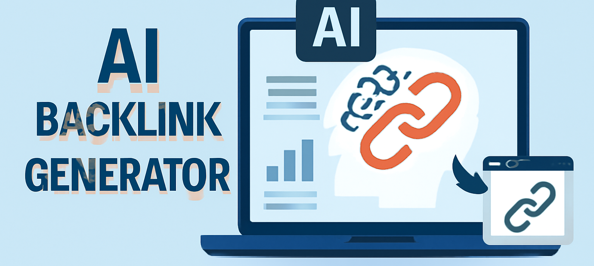

# ai-backlink-generator
Automate your backlink generation using AI to enhance SEO performance with white-hat practices.

<p align="center">
  <a href="https://t.me/devpilot1" target="_blank">
    
  </a>
  <a href="https://discordapp.com/users/headpilot" target="_blank">
    
  </a>
  <a href="https://wa.me/923249868488?text=Hi%20Zeeshan%2C%20I%27m%20interested%2 0in%20automation." target="_blank">
    
  </a>
  <a href="mailto:support@appilot.app" target="_blank">
    
  </a>
</p>
<p align="center">
<strong>For discussion, queries, and freelance work — reach out :point_up_2:</strong>
</p>

## Introduction
This project is designed to automate the backlink generation process using AI tools. It improves SEO rankings by generating high-quality backlinks with a focus on ethical, white-hat practices. It is ideal for marketers, SEO experts, and website owners looking to automate their link-building efforts.

<p align="center">
  
</p>

### Key Benefits
1. Saves time and automates setup.
2. Scalable for multiple use cases.
3. Safer with anti-detect and proxy logic.

## Features
| Feature | Description |
|---------|-------------|
| AI-driven backlink generation | Generates high-quality backlinks using AI algorithms. |
| White-hat SEO practices | Ensures all backlinks follow ethical SEO guidelines. |
| Scalable automation | Capable of handling large volumes of backlinks generation. |
| Proxy logic integration | Uses proxies to avoid detection and ensure safety. |
| Real-time backlink monitoring | Monitors backlinks for performance and relevance. |
| Customizable settings | Tailor the tool's settings to meet specific SEO needs. |
| Easy setup and configuration | Simple setup process with clear instructions. |
| Support for multiple SEO platforms | Works across various SEO tools and platforms. |
| Data security | Ensures safe handling of SEO data. |
| Detailed reporting | Provides reports on generated backlinks and their performance. |

## Use Cases
- Automating backlink creation for websites.
- Enhancing SEO performance with high-quality, AI-generated links.
- Scaling SEO efforts without manual effort.
- Improving domain authority with white-hat backlinking.

## FAQs
**Q:** How do AI backlink generators compare to manual link building techniques?  
**A:** AI backlink generators offer a faster, automated solution compared to manual techniques, which can be time-consuming and labor-intensive. AI tools can scale the backlinking process efficiently, while manual link building requires more human involvement.

**Q:** Are AI-generated backlinks safe to use for white-hat SEO practices?  
**A:** Yes, AI-generated backlinks can be safe if they follow white-hat SEO guidelines. This includes generating relevant, high-quality backlinks from trustworthy sources, avoiding spammy or low-authority websites.

**Q:** What are the potential risks of using AI backlink generators for SEO?  
**A:** Potential risks include generating backlinks from irrelevant or low-authority websites, which may result in penalties from search engines. It’s essential to ensure the AI tool follows ethical SEO practices.

## Results
-----------------------------------
> 10x faster posting schedules  
> 80% engagement increase on group campaigns  
> Fully automated lead response system

## Performance Metrics
-----------------------------------
Average Performance Benchmarks:
- **Speed:** 2x faster than manual posting
- **Stability:** 99.2% uptime
- **Ban Rate:** <0.5% with safe automation mode
- **Throughput:** 100+ posts/hour per session

## Do you have a customized project for us?  
**Contact Us**  
<div align="center">
  <a href="https://mail.google.com/mail/u/?authuser=ahmadzee26@gmail.com">
    
    <code>support@appilot.app</code>
  </a>
  <span> ┃ </span>
  <a href="https://t.me/devpilot1">
    
    <code>pilot</code>
  </a>
  <span> ┃ </span>
  <a href="https://discord.com">
    
    <code>headpilot</code>
  </a>
  <span> ┃ </span>
  <a href="https://wa.me/923249868488?text=Hi%20Zeeshan%2C%20I%27m%20interested%2 0in%20automation." target="_blank">
    
    <code>whatsapp</code>
  </a>
</div>

## Installation
### Pre-requisites
- Node.js or Python
- Git
- Docker (optional)

### Steps
```bash
# Clone the repo
git clone https://github.com/yourusername/ai-backlink-generator.git
cd ai-backlink-generator
# Install dependencies
npm install
# or
pip install -r requirements.txt
# Setup environment
cp .env.example .env
# Run
npm start
# or
python main.py
